1. Начало загрузки классов из пакета `io.vertx`.
```
Please open 'ru.netology.JvmExperience' in VisualVm
10:42:36.998453: loading io.vertx
```
Метаспэйс вначале пуст.
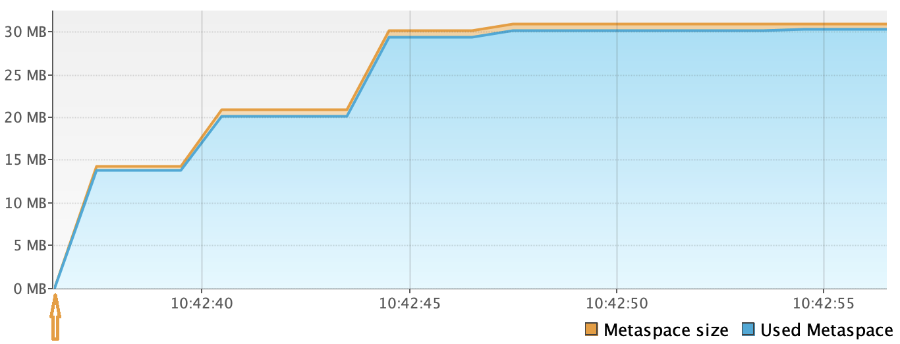
Число загруженных bootstrap-классов примерно равно 2000. Однако в самом начале работы программы их метаданные еще не размещены в метаспэйсе.
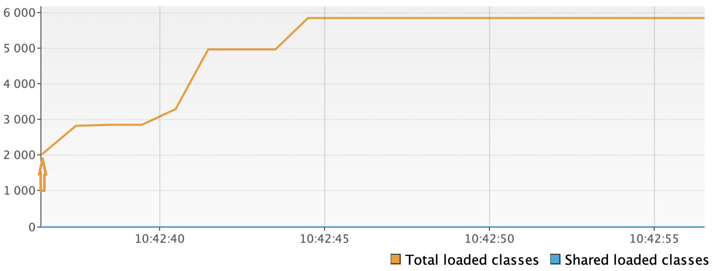
2. Завершение загрузки классов из пакета `io.vertx`.
```
10:42:37.239845: loaded 529 classes
```
Объем метаспэйса увеличился на 15 Мб.
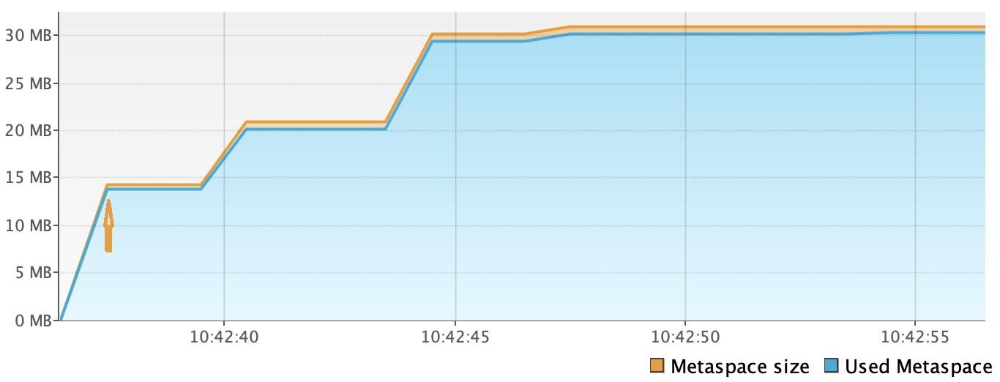
Число загруженных классов явно больше 529. Скорее всего не учтены необходимые классы из других пакетов.
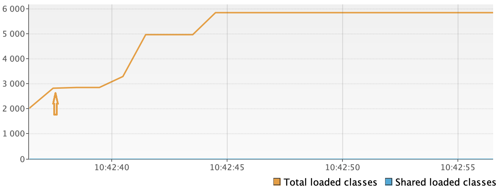
3. Начало загрузки классов из пакета `io.netty`.
```
10:42:40.248268: loading io.netty
```
До начала загрузки нового пакета объем метаспэйса не изменялся.

Количество загруженных классов так же оставалось постоянным.
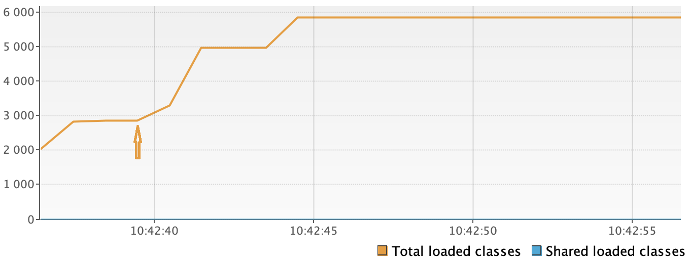
4. Завершение загрузки классов из пакета `io.netty`.
```
10:42:40.694165: loaded 2117 classes
```
Объем метаспэйса увеличился примерно на 5 Мб.

Количество загруженных классов выросло приблизительно на 2000.
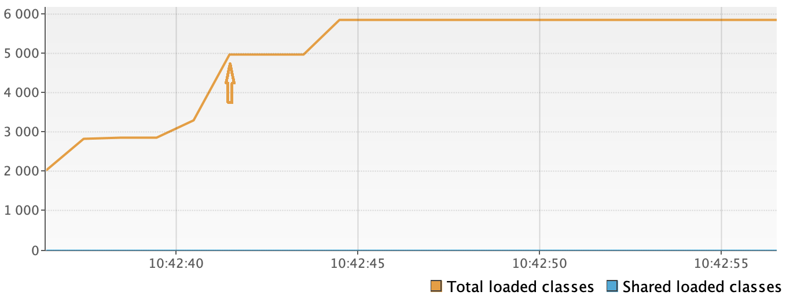
5. Начало загрузки классов из пакета `org.springframework`.
```
10:42:43.699441: loading org.springframework
```
До начала загрузки нового пакета объем метаспэйса не изменялся.
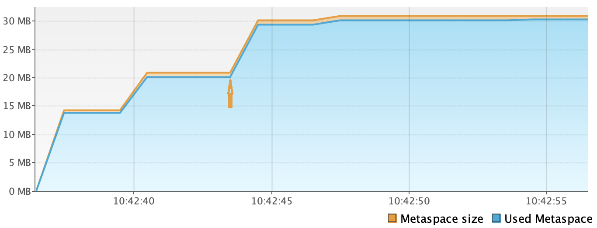
Количество загруженных классов так же оставалось постоянным.
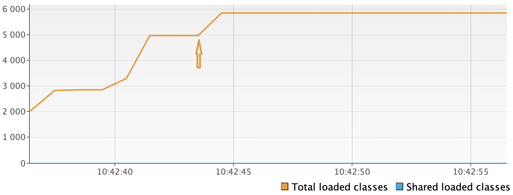
6. Завершение загрузки классов из пакета `org.springframework`.
```
10:42:43.853590: loaded 869 classes
```
Объем метаспэйса увеличился примерно на 10 Мб.
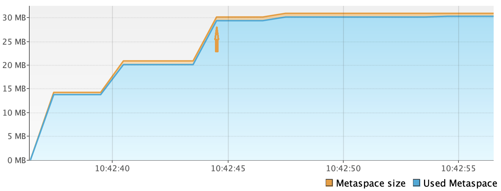
Количество загруженных классов выросло приблизительно на 900.
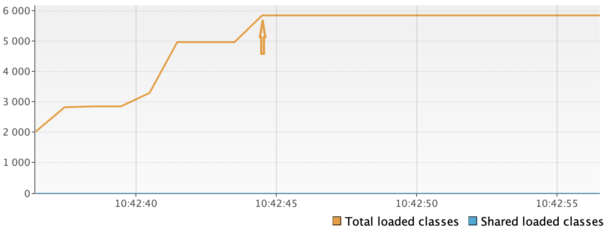
7. Создание 5 миллионов объектов в куче.
```
10:42:46.858856: now see heap
10:42:46.860137: creating 5000000 objects
```
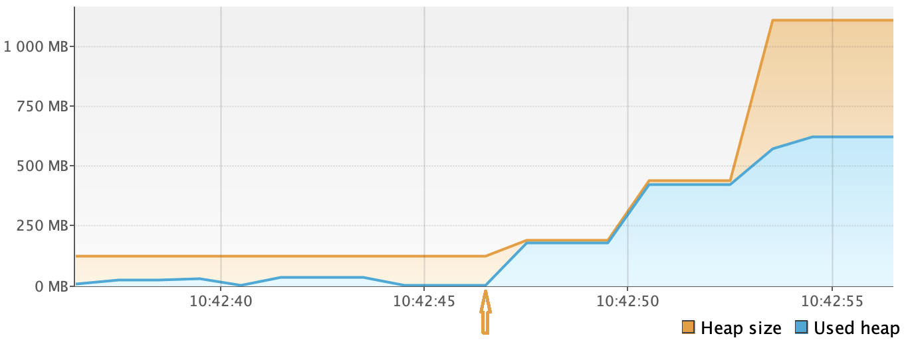
8. В результате занятый объем кучи увеличился примерно на 200 Мб.
```
10:42:47.092354: created
```
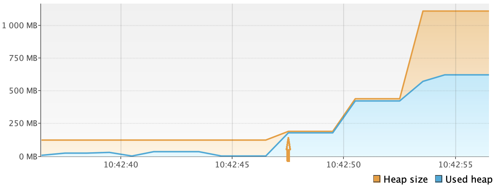
9. До новой итерации создания 5 миллионов объектов объем кучи не изменялся.
```
10:42:50.098108: creating 5000000 objects
```
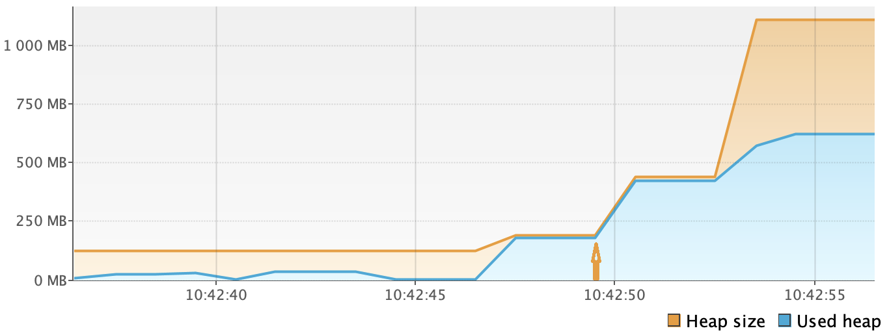
10. После создания 5 миллионов таких же объектов занятый объем кучи вырос еще на 200 Мб.
```
10:42:50.299110: created
```
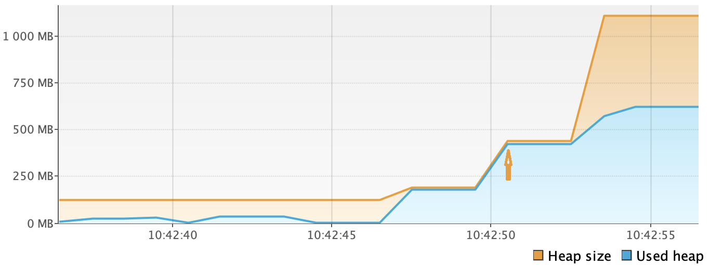
11. Перед последней итерацией добавления объектов доступный объем кучи увеличился более чем в 2 раза. Скорее всего, сборщик мусора предугадал очередное быстрое увеличение занятой памяти.
```
10:42:53.360722: creating 5000000 objects
```
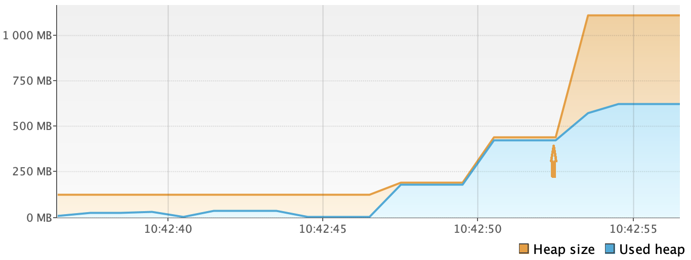
12. Все 15 миллионов объектов были добавлены в кучу.
```
10:42:53.558027: created
```
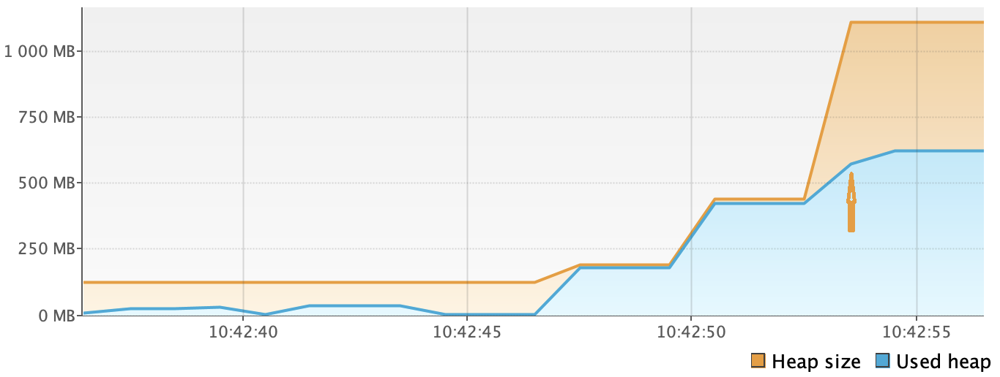